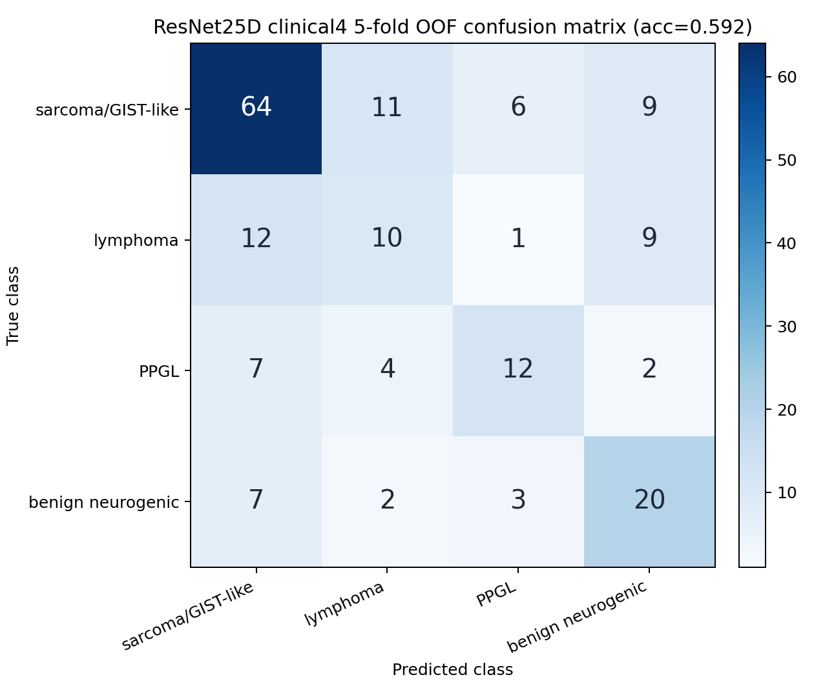
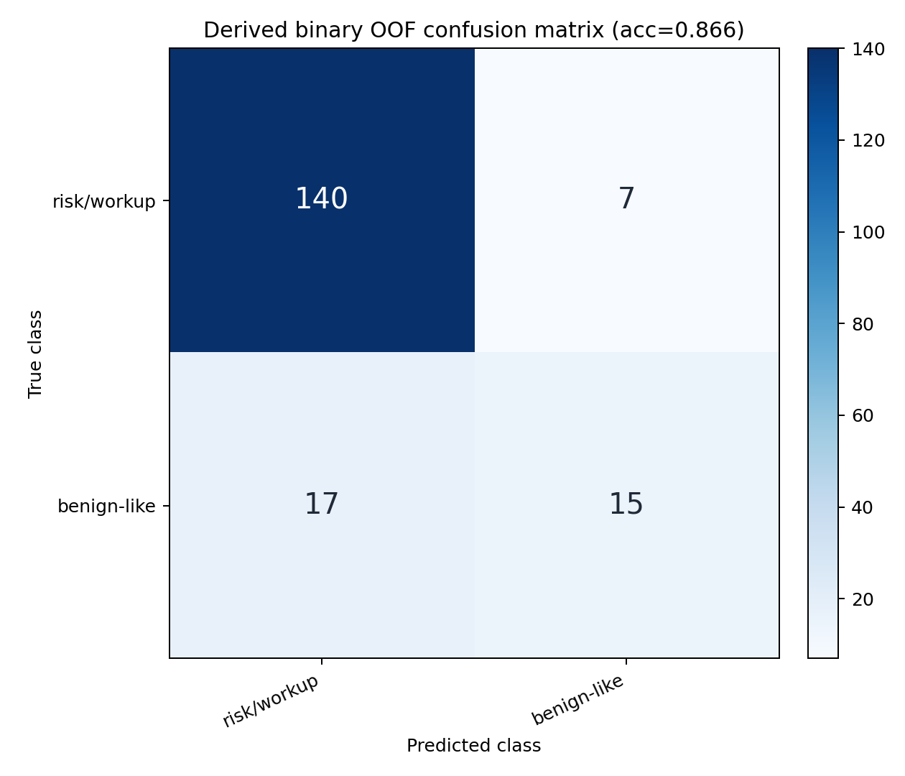

# Retroperitoneal Tumor CT Diagnosis

This repository is intentionally narrowed to the current working pipeline:

1. Generate organ and tumor-candidate masks with the Shenzhen-Yorktal FLARE23 champion project.
2. Use FLARE label `14` to sample lesion-guided 2.5D CT slices.
3. Train an ImageNet-pretrained ResNet18 multi-task gated-MIL model on 4 clinical-imaging groups.

The primary training task is:

| ID | Clinical-imaging group | Source labels |
|---:|---|---|
| 0 | sarcoma/GIST-like | `肉瘤类 + 胃肠道间质瘤` |
| 1 | lymphoma | `淋巴瘤` |
| 2 | PPGL | `PPGL` |
| 3 | benign neurogenic | `良性神经源性肿瘤` |

The derived binary output is computed from the 4-class probabilities:

```text
risk/workup = P(sarcoma/GIST-like) + P(lymphoma) + P(PPGL)
benign-like = P(benign neurogenic)
```

The model also trains an explicit binary head for `risk/workup` vs `benign-like`.
This branch contains the champion-mask 2.5D ResNet pipeline, with 4-class training as the main task.

The remote CUDA environment used for the current reports is recorded in
`requirements-lock.remote-cu128.txt`.

For a compact result summary, see:

```text
reports/CURRENT_REPORT.md
```

## Nephrectomy Prediction

The experimental nephrectomy branch implements a Yang-style 3-D multi-level
feature fusion pipeline for CT plus FLARE23 masks. It compares explicit
tumor-kidney geometry, radiomics, voxel descriptors, task-oriented 3-D deep
features, and their fusion under nested patient-level cross-validation.

See [NEPHRECTOMY_EXPERIMENT.md](NEPHRECTOMY_EXPERIMENT.md).

## External Segmentation

The champion FLARE23 implementation is an external dependency, not vendored code.

See [external/flare23_champion/README.md](external/flare23_champion/README.md).

Remote inference helper:

```bash
bash scripts/monitor_and_run_flare23_champion.sh
```

Expected champion outputs:

```text
/root/autodl-tmp/flare23_champion_outputs/Gxxxx.nii.gz
```

## 2.5D Input

Each case is converted into a tensor:

```text
15 slices x 5 channels x 224 x 224
```

Channels:

1. soft-tissue CT window
2. fat-sensitive CT window
3. tumor mask, FLARE label `14`
4. 2D peritumor shell
5. organ union, FLARE labels `1-13`

The current default keeps cases with at least `5000` champion label14 voxels.

## Run On The Remote GPU Machine

After champion FLARE23 inference and label14 statistics are available:

```bash
bash scripts/run_champion_resnet25d_clinical4_remote.sh
```

The script runs:

1. `scripts/prepare_champion_minvox_labels.py`
2. `scripts/build_flare23_25d_cache.py`
3. `scripts/train_resnet25d_clinical4_cv.py`

Private NIfTI files, Excel sheets, tensor caches, and model weights are ignored by Git.

## Current Result

Current champion-mask 4-class 5-fold OOF result, using `minvox5000`:

| Model | Cases | Accuracy | Balanced Accuracy | Macro F1 | Top-2 Accuracy |
|---|---:|---:|---:|---:|---:|
| Champion FLARE23 + 2.5D ResNet clinical4 multitask | 179 | 0.592 | 0.532 | 0.529 | 0.816 |

Per-class recall:

| Class | Recall |
|---|---:|
| sarcoma/GIST-like | 0.711 |
| lymphoma | 0.312 |
| PPGL | 0.480 |
| benign neurogenic | 0.625 |

Derived binary result from the same 4-class probabilities:

| Output | Accuracy | Balanced Accuracy | Macro F1 | Risk/Workup Recall | Benign-Like Recall |
|---|---:|---:|---:|---:|---:|
| derived from clinical4 probabilities | 0.866 | 0.711 | 0.738 | 0.952 | 0.469 |
| explicit binary head | 0.849 | 0.725 | 0.733 | 0.918 | 0.531 |

Clinical4 confusion matrix:



Derived binary confusion matrix:



Binary head confusion matrix:


Full summary:

```text
reports/champion_resnet25d_clinical4_minvox5000/summary.json
```

Extended OOF evaluation:

| Item | Result |
|---|---:|
| clinical4 macro one-vs-rest ROC-AUC | 0.782 |
| clinical4 macro one-vs-rest PR-AUC | 0.558 |
| derived binary benign recall at risk recall >= 0.95 | 0.531 |
| binary-head benign recall at risk recall >= 0.95 | 0.438 |

See:

```text
reports/champion_resnet25d_clinical4_minvox5000/extended_eval/
```

## P0 Ablations

The P0 signal-source ablations now cover aux-only, no-aux, CT-only, CT + tumor
mask, CT + tumor mask + shell, mask-channel initialization, and `minvox`
thresholds.

Key takeaways:

- Aux-only is much weaker than the image/MIL models, so the result is not just
  an auxiliary-feature shortcut.
- CT + FLARE label14 tumor mask is the strongest no-aux channel combination in
  this seed.
- Zero mask-channel initialization remains the best current default.
- Broadening from `minvox5000` to `minvox1000` or `minvox0` lowers clinical4
  performance, so the cohort threshold must be reported explicitly.

Full table and artifacts:

```text
reports/ablations/README.md
```

## P2 Segmentation-As-Classification Baseline

The REMIND-like pseudo-segmentation baseline trains a small 2D U-Net on cached
2.5D crops, using FLARE label14 pixels as class-aware pseudo masks.

| Model | Cases | Clinical4 Accuracy | Balanced Accuracy | Macro F1 | Top-2 Accuracy |
|---|---:|---:|---:|---:|---:|
| pseudo label14 class-aware 2.5D U-Net | 179 | 0.408 | 0.465 | 0.411 | 0.665 |

This is weaker than the 2.5D ResNet MIL model, so pseudo label14
segmentation-as-classification is currently a control baseline rather than a
replacement.

See:

```text
reports/pseudo_seg25d_clinical4_minvox5000/
```

## P3 Repeated CV

Repeated 5-fold CV across 5 seeds (`20260708` through `20260712`) gives a more
stable estimate of the primary 2.5D ResNet MIL pipeline:

| Metric | Mean | 95% CI |
|---|---:|---:|
| clinical4 accuracy | 0.573 | 0.545-0.602 |
| clinical4 balanced accuracy | 0.505 | 0.469-0.541 |
| clinical4 macro-F1 | 0.502 | 0.466-0.537 |
| clinical4 top-2 accuracy | 0.801 | 0.789-0.813 |
| binary-head accuracy | 0.810 | 0.787-0.833 |
| binary-head balanced accuracy | 0.667 | 0.627-0.707 |
| binary-head benign-like recall | 0.444 | 0.373-0.515 |

The repeated result is slightly below the single primary seed, especially for
binary benign-like recall, so the current model should be described as a
candidate-ranking / risk-triage baseline rather than a stable diagnostic model.

See:

```text
reports/repeated_cv/champion_resnet25d_clinical4_minvox5000/
```

## Repository Layout

```text
scripts/
  monitor_and_run_flare23_champion.sh
  prepare_champion_minvox_labels.py
  build_flare23_25d_cache.py
  train_resnet25d_clinical4_cv.py
  train_aux_clinical4_cv.py
  train_pseudo_seg25d_clinical4_cv.py
  evaluate_oof_clinical4.py
  summarize_repeated_cv.py
  write_public_manifest.py
  run_p0_ablations_remote.sh
  run_pseudo_seg25d_remote.sh
  run_repeated_cv_remote.sh
  run_champion_resnet25d_clinical4_remote.sh
  smoke_test_pipeline.py

external/flare23_champion/
  README.md

reports/champion_resnet25d_clinical4_minvox5000/
  summary.json
  oof_predictions.csv
  oof_predictions_derived_binary.csv
  oof_predictions_binary_head.csv
  resnet25d_clinical4_oof_confusion_matrix.png
  resnet25d_derived_binary_oof_confusion_matrix.png
  resnet25d_binary_head_oof_confusion_matrix.png

reports/ablations/
  README.md
  <run_name>/
    summary.json
    oof_predictions.csv
    oof_predictions_derived_binary.csv
    oof_predictions_binary_head.csv
    *confusion_matrix.png

reports/pseudo_seg25d_clinical4_minvox5000/
  README.md
  summary.json
  oof_predictions.csv
  *confusion_matrix.png

reports/repeated_cv/champion_resnet25d_clinical4_minvox5000/
  README.md
  repeated_cv_summary.json
  seed_metrics.csv
  seed_<seed>/
    summary.json
    oof_predictions.csv
    *confusion_matrix.png

data/champion_flare23_25d_cache_15x224_minvox5000/
  dataset_summary.json
  manifest_public.csv
  tensors_sha256.csv
```
