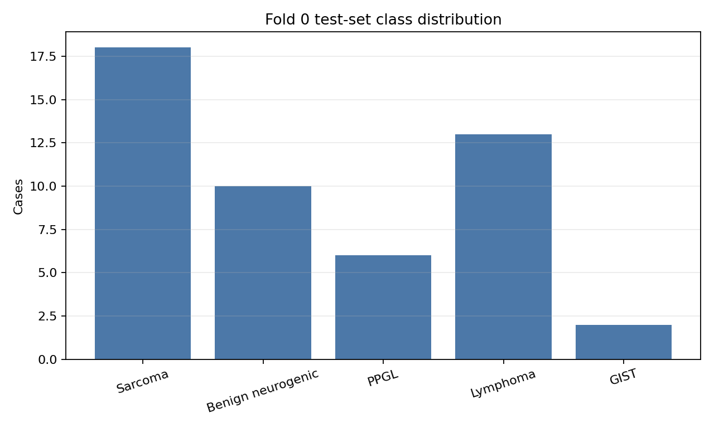
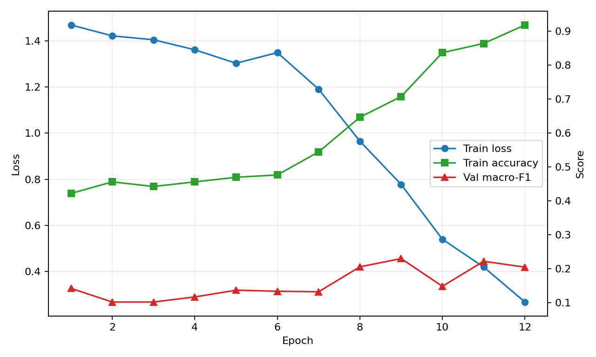
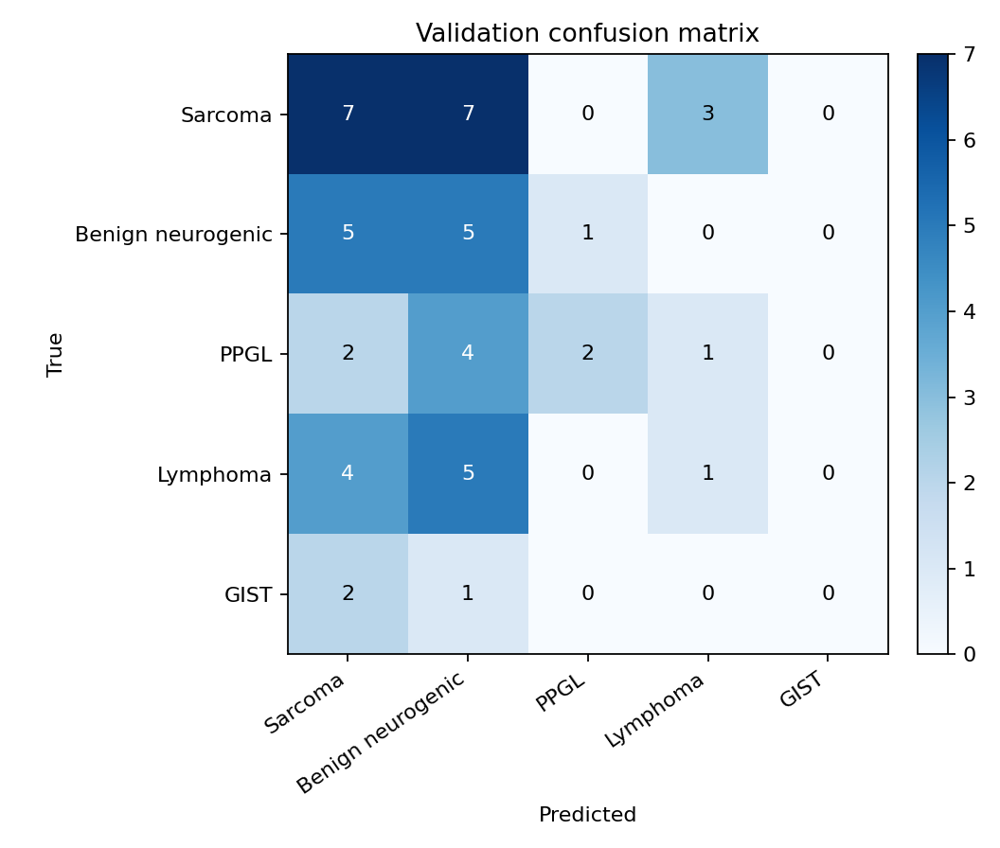
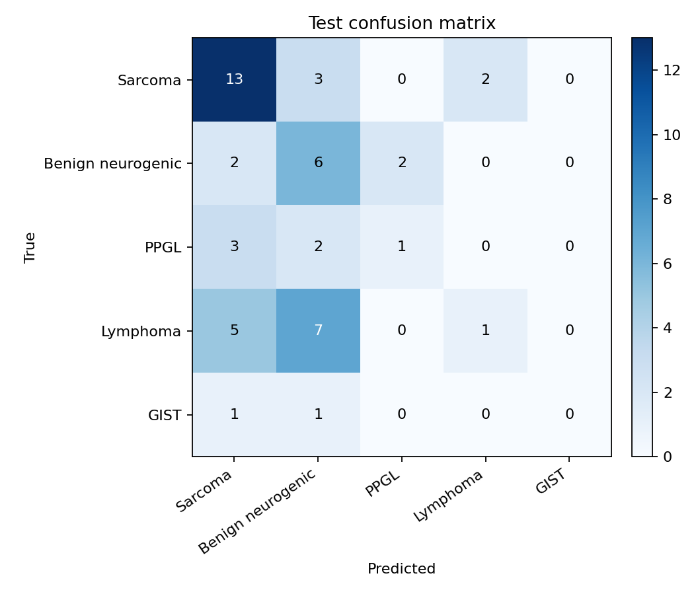

# 5-Class Group-CV Fold 0 Report

## Summary

This run is a lightweight smoke-test baseline for retroperitoneal tumor CT classification. It uses de-identified patient-level group split data, 96-slice three-window CT tensors, an ImageNet-pretrained ResNet18 backbone, and attention MIL pooling.

The result should be read as a pipeline baseline, not as a stable clinical-performance claim.

## Data

| Item | Value |
|---|---:|
| Cases | 246 |
| Patients | 244 |
| Split method | StratifiedGroupKFold by patient hash |
| Fold | 0 |
| Train / val / test | 147 / 50 / 49 |

## Method

Each CT case is represented as `96 x 3 x 224 x 224`: 96 uniformly sampled axial slices and three CT windows per slice.

| Component | Setting |
|---|---|
| Backbone | ResNet18, ImageNet pretrained |
| Pooling | Attention MIL |
| Classes | 肉瘤类, 良性神经源性肿瘤, PPGL, 淋巴瘤, 胃肠道间质瘤 |
| Training | Freeze backbone for 5 epochs, then unfreeze layer4 |
| BatchNorm | Frozen/eval |
| Loss | Class-weighted cross entropy |

## Training

Best validation macro-F1 occurred at epoch 9 with macro-F1 `0.230`. The final training accuracy reached `0.918`, which indicates clear overfitting.

## Validation

### Validation Metrics

| Metric | Value |
|---|---:|
| accuracy | 0.300 |
| balanced accuracy | 0.238 |
| macro-F1 | 0.230 |
| weighted-F1 | 0.282 |

| Class | Recall |
|---|---:|
| 肉瘤类 | 0.412 |
| 良性神经源性肿瘤 | 0.455 |
| PPGL | 0.222 |
| 淋巴瘤 | 0.100 |
| 胃肠道间质瘤 | 0.000 |

## Test

### Test Metrics

| Metric | Value |
|---|---:|
| accuracy | 0.429 |
| balanced accuracy | 0.313 |
| macro-F1 | 0.276 |
| weighted-F1 | 0.372 |

| Class | Recall |
|---|---:|
| 肉瘤类 | 0.722 |
| 良性神经源性肿瘤 | 0.600 |
| PPGL | 0.167 |
| 淋巴瘤 | 0.077 |
| 胃肠道间质瘤 | 0.000 |

## Interpretation

The model mainly recognizes sarcoma and part of benign neurogenic tumors. PPGL and lymphoma remain weak, and GIST recall is still zero. The main bottleneck is likely not model size, but limited sample size, class imbalance, and the lack of lesion localization or body crop.
