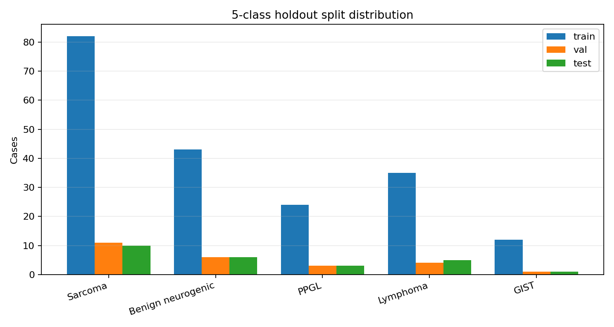
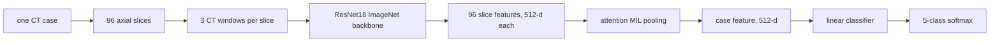
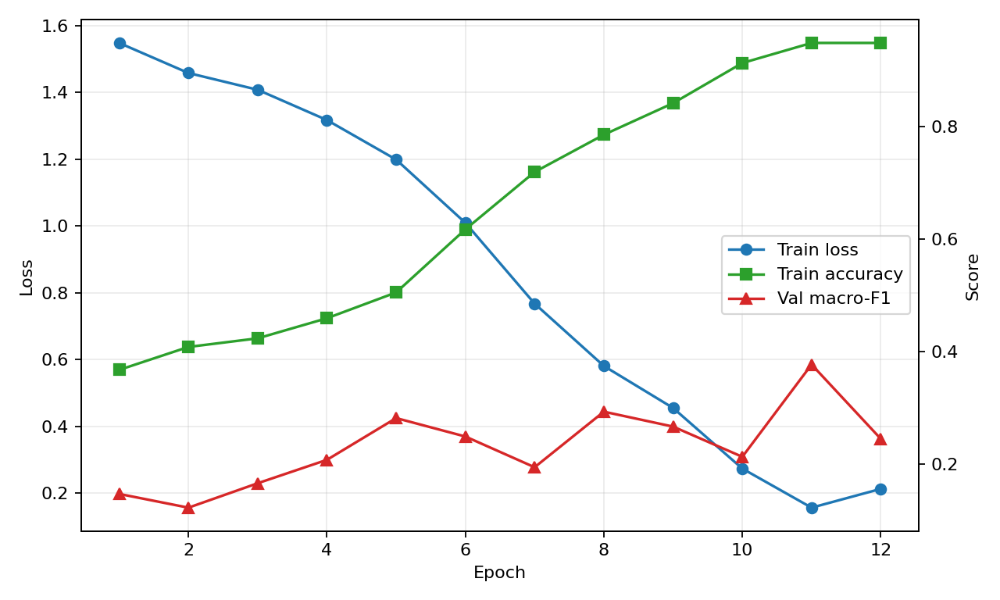
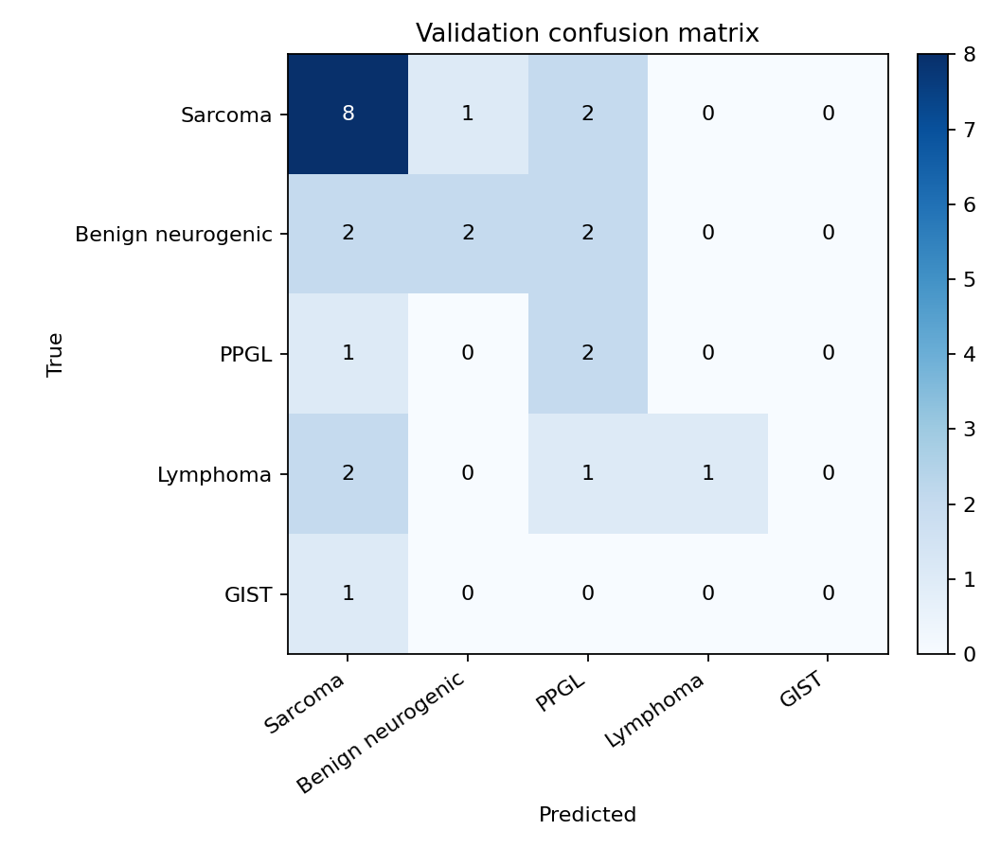
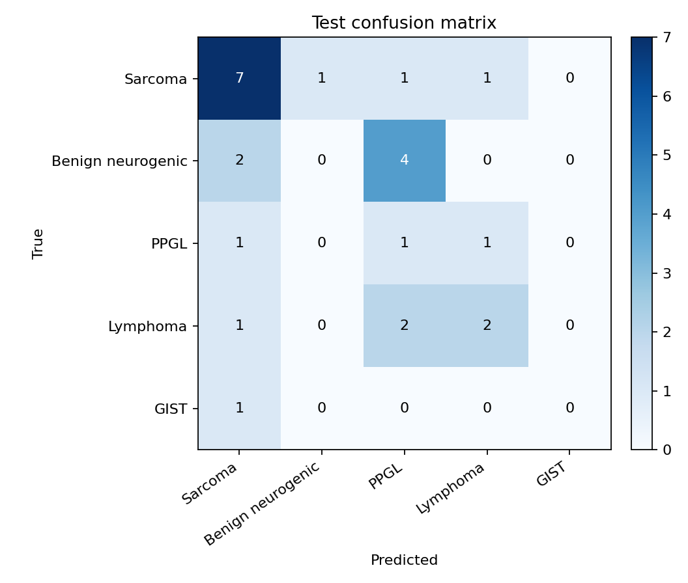

# 腹膜后肿瘤 CT 五分类 2.5D MIL 实验报告

生成日期：2026-07-03  
项目目录：`retroperitoneal_tumor_diagnosis`

## 0. 2026-07-03 修订说明

本报告记录的是早期 25 例 holdout smoke test，用来证明数据读取、96-slice 三窗 cache、MIL 训练和结果输出可以跑通。后续审计发现旧 holdout split 存在 1 组同患者跨 train/test 的病例级泄漏风险，因此旧 holdout 指标不能作为正式泛化性能结论。

当前主线已改为：

- 使用 salted `patient_uid_hash` 做 patient-level grouping；
- 生成 `data/labels_5class_groupcv_deid/` 脱敏 5-fold `StratifiedGroupKFold` split；
- GitHub 只保留脱敏 CSV/JSON 和报告，不保留源 Excel、姓名、住院号、病理号、出生日期、病理原文、本地绝对路径、原始 NIfTI、tensor cache 和模型权重；
- 旧结果只作为 pipeline smoke test 留档。

## 1. 实验定位

这一版不是正式临床性能实验，而是一个可以在 GPU 上完整跑通的主线 baseline：使用已有增强 CT NIfTI，生成固定 96 张轴位 slice 的三窗输入，再用 ImageNet 预训练 ResNet18 提取 slice 特征，通过 attention MIL 做病例级五分类。

最重要的取舍是：不做肿瘤分割、不做逐层 ROI、不做手工粗框。这样成本低，能先验证从数据表、NIfTI、预处理、缓存、训练、验证到测试输出的全链路。

## 2. 数据整理

原始数据来自项目内的私有 NIfTI 目录。当前 GitHub 只保存脱敏标签、cache 索引、指标和报告，不保存原始 NIfTI、源 Excel 或 PHI 字段。

| 项目 | 数量/说明 |
|---|---:|
| 原始 NIfTI | 252 |
| gzip 损坏并跳过 | 3 |
| 成功生成 96-slice cache | 249 |
| 有监督标签并进入五分类 | 246 |
| train / val / test | 196 / 25 / 25 |

跳过的坏 NIfTI：`G0122`、`G0137`、`G0369`。  
另外 `G0180`、`G0224`、`G0296` 当前没有合适监督标签，未进入训练。

### 五分类设计

这一版从原四分类扩展成五分类，目的是尽量多利用现有病例，同时保持病理意义比较清楚：

| 类别 | 总数 | train | val | test |
|---|---:|---:|---:|---:|
| 肉瘤类 | 103 | 82 | 11 | 10 |
| 良性神经源性肿瘤 | 55 | 43 | 6 | 6 |
| PPGL | 30 | 24 | 3 | 3 |
| 淋巴瘤 | 44 | 35 | 4 | 5 |
| 胃肠道间质瘤 | 14 | 12 | 1 | 1 |

## 3. 预处理

预处理脚本：`code/build_96slice_dataset.py`

每个 CT volume 被转成一个病例级 tensor：`[96, 3, 224, 224]`。

处理流程如下：

1. 用 `nibabel` 读取 `.nii.gz`。
2. 沿 axial 方向均匀采样 96 张 slice。
3. 每张 slice resize 到 `224 x 224`。
4. 对同一张 slice 生成三个 CT 窗，拼成 3 通道：
   - soft tissue：`[-160, 240]`
   - fat-sensitive：`[-200, 100]`
   - wide abdomen：`[-200, 400]`
5. 每个窗线性归一化到 `[0, 1]`。
6. 保存为 `uint8` tensor cache，训练时再转回 float 并做 ImageNet mean/std 标准化。

这一步把 CPU 端的 NIfTI 解压、切片、resize 和窗宽窗位计算提前完成。训练时直接读取 `.pt` cache，可以明显减少 GPU 等 CPU 的时间。

## 4. 模型结构

训练脚本：`code/train_mil_cached_5class_holdout.py`

模型是一个简洁的 2.5D attention MIL：

具体定义：

| 模块 | 设计 |
|---|---|
| backbone | `torchvision.models.resnet18(weights=ResNet18_Weights.DEFAULT)` |
| slice feature | 去掉 ResNet18 `fc` 后，每张 slice 输出 512 维特征 |
| MIL attention | `Linear(512,128) -> Tanh -> Linear(128,1)` |
| pooling | 对 96 张 slice 的 attention score 做 softmax，再加权求和 |
| classifier | `Linear(512,5)` |
| loss | class-weighted cross entropy |
| optimizer | AdamW, lr `1e-4`, weight decay `1e-4` |
| epoch | 12 |
| batch size | 1 |
| checkpoint | 按 validation macro-F1 保存 `model_best.pt` |

这一版是无分割弱监督：标签只在病例级别，模型自己学习哪些 slice 对病例诊断更重要。输出里保存了每例 attention 最大的 slice index，后面可以用来做可视化检查。

## 5. 训练过程

训练在远端 NVIDIA GPU 上完成，训练日志保存在 `models/5class_holdout/train_log.csv`。这轮很快出现过拟合：训练 accuracy 从 0.367 上升到 0.949，但 validation macro-F1 波动明显，最高只到 0.377，对应第 11 个 epoch。

从曲线看，模型确实学到了训练集，但验证集没有同步稳定提升。这个现象符合当前数据条件：样本量仍偏小、类别不平衡明显、没有 ROI 或 body crop，模型需要在整张腹部 CT 里自己找到病灶。

## 6. 验证集结果

### Validation

| 指标 | 数值 |
|---|---:|
| accuracy | 0.520 |
| balanced accuracy | 0.395 |
| macro-F1 | 0.377 |
| weighted-F1 | 0.500 |

| 类别 | recall |
|---|---:|
| 肉瘤类 | 0.727 |
| 良性神经源性肿瘤 | 0.333 |
| PPGL | 0.667 |
| 淋巴瘤 | 0.250 |
| 胃肠道间质瘤 | 0.000 |

验证集 macro-F1 为 0.377，weighted-F1 为 0.500。模型对肉瘤类召回较高，对 GIST 基本没有识别能力，这和 GIST 样本数很少有关。

## 7. 测试集结果

### Test

| 指标 | 数值 |
|---|---:|
| accuracy | 0.400 |
| balanced accuracy | 0.287 |
| macro-F1 | 0.253 |
| weighted-F1 | 0.365 |

| 类别 | recall |
|---|---:|
| 肉瘤类 | 0.700 |
| 良性神经源性肿瘤 | 0.000 |
| PPGL | 0.333 |
| 淋巴瘤 | 0.400 |
| 胃肠道间质瘤 | 0.000 |

测试集只有 25 例，因此这个结果只能作为 pipeline smoke test。当前测试集 accuracy 为 0.400，macro-F1 为 0.253。测试集中肉瘤类 10 例识别出 7 例，但良性神经源性肿瘤 6 例全部没有被正确分出，PPGL 和淋巴瘤也只是部分识别。

## 8. 当前结论

这轮实验说明：

- 数据读取、标签映射、96-slice 三窗 cache、ResNet18 + attention MIL、训练循环、验证和测试输出都已经跑通。
- 模型可以快速记住训练集，说明网络容量足够，但泛化不稳定，当前结果不能当可靠性能结论。
- 最大瓶颈不是显存，而是数据量、标签噪声、类别不平衡以及没有 lesion-level 信息。
- 目前最适合把这版作为 baseline，而不是作为最终模型。

## 9. 下一步建议

短期可以继续保持这条主线，不要把工程弄复杂：

1. 数据继续补齐后，重新生成 `data/standard`、`data/cache_96slice` 和 `data/labels_5class_holdout`。
2. 正式版改成 5-fold stratified group cross-validation，而不是单次 holdout。
3. 加 body crop 或粗框 crop，优先减少无关腹部背景。
4. 训练策略从“全量解冻”调整为先冻结 backbone，再只解冻 layer4，降低小样本过拟合。
5. 对少数类使用 weighted sampler 或轻量增强，但不要把增强样本混进 test。
6. 保留医学预训练作为后续对照，不把 3D 大模型作为当前主线。

## 10. 文件位置

| 文件 | 作用 |
|---|---|
| `code/build_96slice_dataset.py` | 从 NIfTI 生成 96-slice 三窗 tensor cache |
| `code/build_5class_holdout_dataset.py` | 生成五分类标签表和 train/val/test split |
| `code/train_mil_cached_5class_holdout.py` | 训练 ResNet18 attention MIL 五分类模型 |
| `data/labels_5class_holdout/` | 当前五分类监督数据表 |
| `models/5class_holdout/` | 当前训练日志、预测和指标；`.pt` 权重不进 GitHub |
| `reports/5class_holdout_report.md` | 本报告 |
