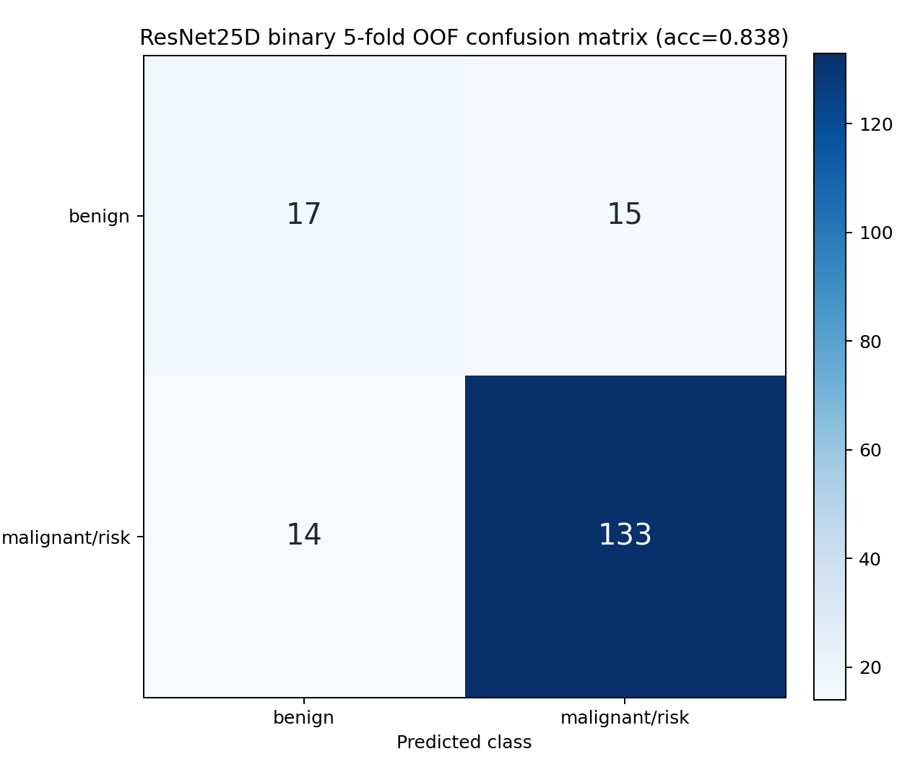

# Champion FLARE23 + 2.5D ResNet Binary CV

Task: `良性神经源性肿瘤` vs `肉瘤类 + PPGL + 淋巴瘤 + 胃肠道间质瘤`.

Mask source: Shenzhen-Yorktal FLARE23 champion outputs.

Filter: champion label14 tumor voxels `>= 5000`.

OOF metrics:

| Cases | Accuracy | Balanced Accuracy | Macro F1 | Weighted F1 | Benign Recall | Risk Recall |
|---:|---:|---:|---:|---:|---:|---:|
| 179 | 0.838 | 0.718 | 0.721 | 0.837 | 0.531 | 0.905 |

Confusion matrix order: `[benign, malignant/risk]`.

```text
[[17, 15],
 [14, 133]]
```


