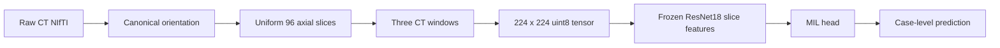
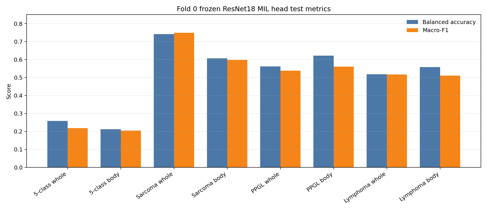
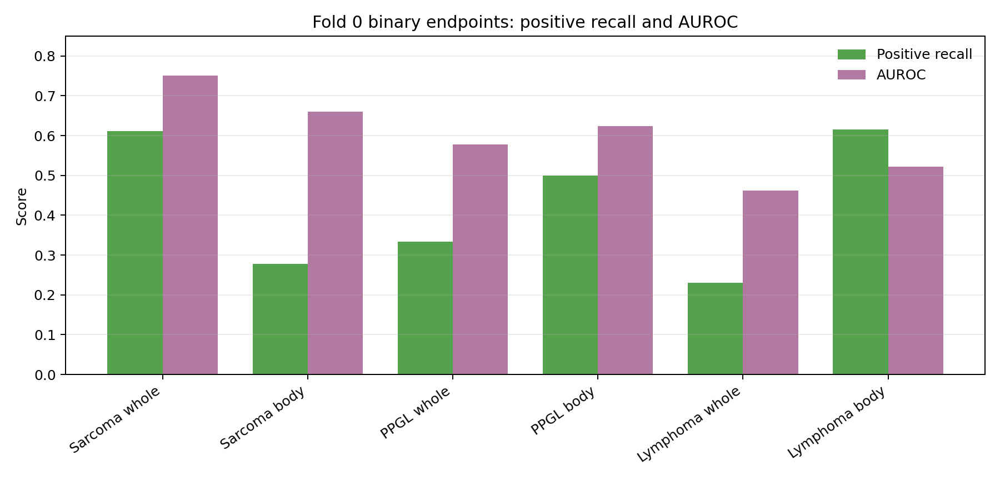

# Fold 0 Frozen-Feature MIL and Body-Crop Report

This report summarizes the first lightweight experiment following the current small-data strategy: keep the ResNet18 backbone frozen, compare whole-abdomen versus body-crop inputs, and evaluate clinically meaningful binary endpoints alongside exploratory five-class classification.

The results below are a pipeline and ablation smoke test on fold 0 only. They should not be read as stable clinical performance.

## Data Snapshot

| Item | Count / Setting |
|---|---:|
| Original CT NIfTI files | 252 |
| Corrupted NIfTI excluded | 3 |
| 96-slice cache cases | 249 |
| Supervised five-class cases | 246 |
| Unique salted patient groups | 244 |
| Split method | 5-fold StratifiedGroupKFold |
| Fold used here | fold 0 |

Five-class labels:

| Class | Cases |
|---|---:|
| 肉瘤类 | 103 |
| 良性神经源性肿瘤 | 55 |
| 淋巴瘤 | 44 |
| PPGL | 30 |
| 胃肠道间质瘤 | 14 |

## Preprocessing

Both input caches use the same case list and labels.

The three CT windows are:

| Channel | HU range |
|---|---:|
| Soft tissue | [-160, 240] |
| Fat-sensitive | [-200, 100] |
| Wide abdomen | [-200, 400] |

Two cache variants were compared:

| Cache | Description |
|---|---|
| `cache_96slice` | Whole axial slice resized to 224 x 224 |
| `cache_body_96slice` | Body mask from `HU > -500`, x/y union bbox across the volume, 16-pixel padding, then resize |

The body crop is intentionally simple. It removes air, table/background, and some scanner-field variation. It does not localize the tumor.

## Model

This run uses a frozen ImageNet-pretrained ResNet18 as a slice feature extractor.

| Component | Setting |
|---|---|
| Backbone | torchvision ResNet18 |
| Pretraining | ImageNet |
| Backbone training | frozen |
| Feature per slice | 512-d |
| Bag per case | 96 x 512 |
| MIL pooling | mean feature + max feature concatenation |
| Classifier | linear layer |
| Optimizer | AdamW |
| Epochs | 80 |
| Batch size | 16 |
| Loss | class-weighted cross entropy |

Mean+max pooling was used because it is a low-parameter baseline and is often more stable than attention in very small datasets.

## Tasks

The experiment ran four tasks on the same fold:

| Task | Type |
|---|---|
| Five-class diagnosis | exploratory multiclass |
| 肉瘤类 vs non-肉瘤类 | binary endpoint |
| PPGL vs non-PPGL | binary endpoint |
| 淋巴瘤 vs non-淋巴瘤 | binary endpoint |

## Fold 0 Results

| Task | Input | Split | Accuracy | Balanced Acc | Macro-F1 | Weighted-F1 | AUROC | AUPRC |
|---|---|---:|---:|---:|---:|---:|---:|---:|
| 5class | whole abdomen | val | 0.360 | 0.288 | 0.299 | 0.352 |  |  |
| 5class | whole abdomen | test | 0.367 | 0.258 | 0.218 | 0.304 |  |  |
| 5class | body crop | val | 0.340 | 0.332 | 0.361 | 0.344 |  |  |
| 5class | body crop | test | 0.286 | 0.212 | 0.204 | 0.285 |  |  |
| sarcoma | whole abdomen | val | 0.620 | 0.555 | 0.556 | 0.610 | 0.538 | 0.444 |
| sarcoma | whole abdomen | test | 0.776 | 0.741 | 0.749 | 0.770 | 0.751 | 0.615 |
| sarcoma | body crop | val | 0.700 | 0.602 | 0.600 | 0.664 | 0.563 | 0.434 |
| sarcoma | body crop | test | 0.694 | 0.607 | 0.597 | 0.650 | 0.659 | 0.562 |
| PPGL | whole abdomen | val | 0.820 | 0.587 | 0.602 | 0.791 | 0.618 | 0.299 |
| PPGL | whole abdomen | test | 0.735 | 0.562 | 0.537 | 0.766 | 0.578 | 0.175 |
| PPGL | body crop | val | 0.820 | 0.673 | 0.681 | 0.816 | 0.650 | 0.432 |
| PPGL | body crop | test | 0.714 | 0.622 | 0.560 | 0.757 | 0.624 | 0.201 |
| lymphoma | whole abdomen | val | 0.700 | 0.550 | 0.548 | 0.705 | 0.552 | 0.319 |
| lymphoma | whole abdomen | test | 0.653 | 0.518 | 0.517 | 0.637 | 0.462 | 0.266 |
| lymphoma | body crop | val | 0.560 | 0.537 | 0.494 | 0.604 | 0.457 | 0.193 |
| lymphoma | body crop | test | 0.531 | 0.558 | 0.510 | 0.557 | 0.521 | 0.296 |

## Binary Endpoint Details

Positive-class recall on fold 0 test:

| Task | Whole abdomen | Body crop |
|---|---:|---:|
| Sarcoma recall | 0.611 | 0.278 |
| PPGL recall | 0.333 | 0.500 |
| Lymphoma recall | 0.231 | 0.615 |

Fold 0 suggests different behavior by task:

- Sarcoma performed best with whole-abdomen features in this split.
- PPGL improved with body crop on balanced accuracy, macro-F1, AUROC, AUPRC, and PPGL recall.
- Lymphoma body crop traded lower overall accuracy for much higher positive recall.
- Five-class performance remains weak, especially because the GIST class has only 14 cases.

## Interpretation

The frozen-feature setup is useful because it removes most of the trainable capacity from the model. This directly addresses the earlier overfitting pattern seen when fine-tuning image features on the small dataset.

The body crop is not uniformly better on fold 0. That is still informative. It likely helps tasks where irrelevant background hurts positive-class sensitivity, but it can also remove or distort contextual cues that the whole-abdomen model uses. With only one fold, this variation should be treated as noise until full 5-fold results are available.

The binary endpoints are more interpretable than the five-class task. This supports the current plan: keep five-class as exploratory, but report sarcoma, PPGL, and lymphoma one-vs-rest endpoints as the more clinically meaningful small-data analyses.

## Files Produced

| Artifact | Path |
|---|---|
| Whole cache metadata | `data/cache_96slice/` |
| Body-crop cache metadata | `data/cache_body_96slice/` |
| Whole frozen features metadata | `data/features_cache_96slice_resnet18/` |
| Body frozen features metadata | `data/features_cache_body_96slice_resnet18/` |
| Fold 0 runs | `runs/*features*_fold0_meanmax/` |
| Metric figure | `reports/assets/fold0_frozen_metric_bars.png` |
| Binary endpoint figure | `reports/assets/fold0_binary_positive_recall_auroc.png` |

GitHub keeps only de-identified labels, split files, cache metadata, metrics, predictions, and report figures. Raw NIfTI files, tensor caches, feature tensors, source Excel sheets, PHI linkage tables, salt files, and model weights remain private and ignored.

## Next Steps

The next reliable step is not a larger model. It is to finish the same frozen-feature comparison across all five folds and report mean +/- standard deviation for:

- five-class exploratory macro-F1 and balanced accuracy;
- sarcoma vs non-sarcoma AUROC, AUPRC, recall, and balanced accuracy;
- PPGL vs non-PPGL AUROC, AUPRC, recall, and balanced accuracy;
- lymphoma vs non-lymphoma AUROC, AUPRC, recall, and balanced accuracy.

After that, the most valuable improvement is a better crop: retroperitoneal context crop first, then a small manually annotated lesion-center/bbox subset before trying ROI-based 3D models.
