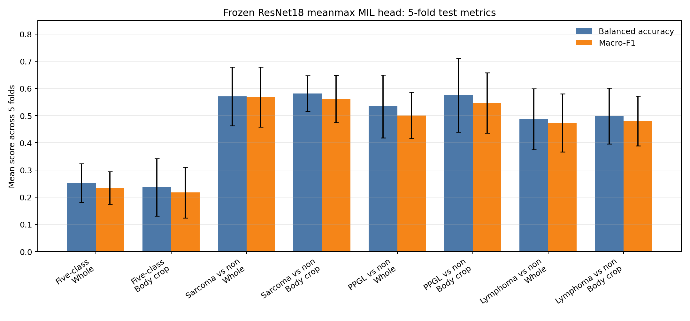
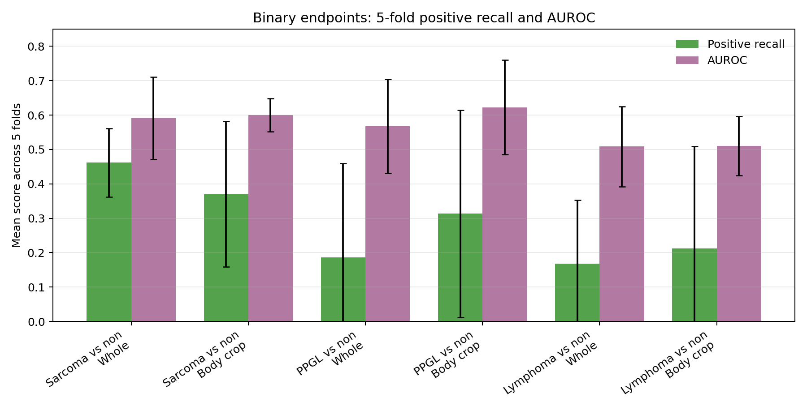

# Frozen-Feature Meanmax MIL 5-Fold Report

This report updates the fold 0 smoke test to a patient-level 5-fold summary. It compares whole-abdomen and simple body-crop inputs using the same de-identified labels and folds.

The model is intentionally small: a frozen ImageNet ResNet18 extracts 96 slice features per case, and a mean+max MIL head trains only a linear classifier on pooled features.

## Test Summary

| Task | Input | balanced_accuracy | macro_f1 | weighted_f1 | accuracy | auroc | average_precision |
| --- | --- | --- | --- | --- | --- | --- | --- |
| Five-class | Whole | 0.252 +/- 0.071 | 0.234 +/- 0.060 | 0.324 +/- 0.076 | 0.330 +/- 0.085 |  |  |
| Five-class | Body crop | 0.236 +/- 0.106 | 0.217 +/- 0.094 | 0.287 +/- 0.069 | 0.288 +/- 0.098 |  |  |
| Sarcoma vs non | Whole | 0.571 +/- 0.108 | 0.568 +/- 0.110 | 0.584 +/- 0.118 | 0.590 +/- 0.121 | 0.591 +/- 0.119 | 0.570 +/- 0.086 |
| Sarcoma vs non | Body crop | 0.581 +/- 0.066 | 0.561 +/- 0.087 | 0.586 +/- 0.094 | 0.617 +/- 0.078 | 0.600 +/- 0.048 | 0.543 +/- 0.032 |
| PPGL vs non | Whole | 0.534 +/- 0.116 | 0.501 +/- 0.085 | 0.786 +/- 0.066 | 0.793 +/- 0.086 | 0.568 +/- 0.136 | 0.181 +/- 0.063 |
| PPGL vs non | Body crop | 0.575 +/- 0.136 | 0.547 +/- 0.111 | 0.795 +/- 0.067 | 0.781 +/- 0.095 | 0.622 +/- 0.137 | 0.223 +/- 0.089 |
| Lymphoma vs non | Whole | 0.487 +/- 0.112 | 0.473 +/- 0.107 | 0.687 +/- 0.110 | 0.692 +/- 0.162 | 0.508 +/- 0.117 | 0.243 +/- 0.085 |
| Lymphoma vs non | Body crop | 0.498 +/- 0.103 | 0.480 +/- 0.091 | 0.697 +/- 0.101 | 0.700 +/- 0.127 | 0.510 +/- 0.086 | 0.223 +/- 0.078 |

## Validation Summary

| Task | Input | balanced_accuracy | macro_f1 | weighted_f1 | accuracy | auroc | average_precision |
| --- | --- | --- | --- | --- | --- | --- | --- |
| Five-class | Whole | 0.333 +/- 0.103 | 0.289 +/- 0.059 | 0.363 +/- 0.072 | 0.370 +/- 0.079 |  |  |
| Five-class | Body crop | 0.347 +/- 0.076 | 0.286 +/- 0.060 | 0.352 +/- 0.042 | 0.358 +/- 0.032 |  |  |
| Sarcoma vs non | Whole | 0.613 +/- 0.068 | 0.614 +/- 0.071 | 0.634 +/- 0.073 | 0.643 +/- 0.075 | 0.605 +/- 0.075 | 0.587 +/- 0.092 |
| Sarcoma vs non | Body crop | 0.626 +/- 0.059 | 0.623 +/- 0.065 | 0.646 +/- 0.074 | 0.667 +/- 0.080 | 0.582 +/- 0.038 | 0.561 +/- 0.073 |
| PPGL vs non | Whole | 0.565 +/- 0.048 | 0.556 +/- 0.064 | 0.821 +/- 0.027 | 0.833 +/- 0.053 | 0.508 +/- 0.091 | 0.191 +/- 0.088 |
| PPGL vs non | Body crop | 0.595 +/- 0.058 | 0.587 +/- 0.071 | 0.815 +/- 0.064 | 0.805 +/- 0.093 | 0.579 +/- 0.106 | 0.238 +/- 0.121 |
| Lymphoma vs non | Whole | 0.586 +/- 0.082 | 0.570 +/- 0.076 | 0.757 +/- 0.083 | 0.764 +/- 0.100 | 0.579 +/- 0.065 | 0.260 +/- 0.070 |
| Lymphoma vs non | Body crop | 0.575 +/- 0.056 | 0.559 +/- 0.072 | 0.744 +/- 0.096 | 0.748 +/- 0.124 | 0.586 +/- 0.086 | 0.262 +/- 0.072 |

## Binary Endpoint Detail

| Task | Input | positive_recall | balanced_accuracy | macro_f1 | auroc | average_precision |
| --- | --- | --- | --- | --- | --- | --- |
| Sarcoma vs non | Whole | 0.462 +/- 0.100 | 0.571 +/- 0.108 | 0.568 +/- 0.110 | 0.591 +/- 0.119 | 0.570 +/- 0.086 |
| Sarcoma vs non | Body crop | 0.370 +/- 0.212 | 0.581 +/- 0.066 | 0.561 +/- 0.087 | 0.600 +/- 0.048 | 0.543 +/- 0.032 |
| PPGL vs non | Whole | 0.187 +/- 0.272 | 0.534 +/- 0.116 | 0.501 +/- 0.085 | 0.568 +/- 0.136 | 0.181 +/- 0.063 |
| PPGL vs non | Body crop | 0.313 +/- 0.301 | 0.575 +/- 0.136 | 0.547 +/- 0.111 | 0.622 +/- 0.137 | 0.223 +/- 0.089 |
| Lymphoma vs non | Whole | 0.168 +/- 0.185 | 0.487 +/- 0.112 | 0.473 +/- 0.107 | 0.508 +/- 0.117 | 0.243 +/- 0.085 |
| Lymphoma vs non | Body crop | 0.212 +/- 0.296 | 0.498 +/- 0.103 | 0.480 +/- 0.091 | 0.510 +/- 0.086 | 0.223 +/- 0.078 |

## Interpretation

- Five-class classification remains weak and should stay exploratory, especially because the GIST class is small.
- The binary endpoints are more interpretable and should be the main reporting line for this stage.
- Body crop is not uniformly better. Its value depends on the endpoint, so the next useful input improvement is a more anatomy-aware retroperitoneal crop or a small lesion-bbox subset.
- These results still do not support jumping to a whole-volume 3D model. The priority remains better localization/crop before larger models.

## Artifacts

- Summary CSV: `reports/frozen_feature_meanmax_5fold_summary.csv`
- Summary JSON: `reports/frozen_feature_meanmax_5fold_summary.json`
- Core metric figure: `reports/assets/meanmax_5fold_test_core_metrics.png`
- Binary metric figure: `reports/assets/meanmax_5fold_binary_recall_auroc.png`
