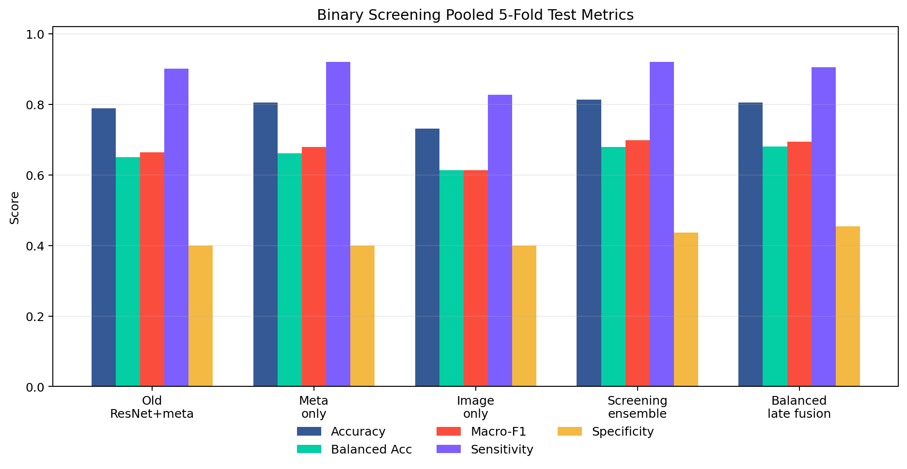
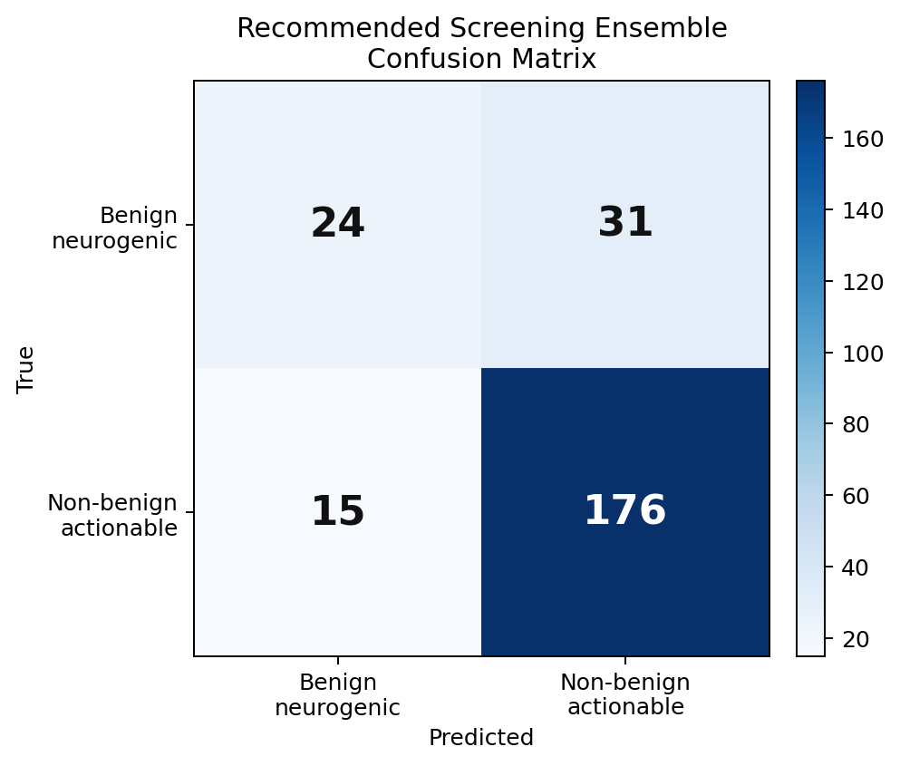

项目仓库：`retroperitoneal-tumor-diagnosis`

当前主线任务：

> 良性神经源性肿瘤 vs 非良性/需处理腹膜后肿瘤

本报告面向研究数学、统计学习和算法的合作者，目标是不阅读代码也能完整理解当前数据如何整理、影像如何预处理、模型如何构造、训练和评价如何进行，以及当前结果应如何解释。

---

## 1. 总览

### 1.1 当前问题不是严格的“良恶性分类”

当前二分类任务的医学语义是筛查式的：

- 阴性类：良性神经源性肿瘤。
- 阳性类：非良性或需要进一步处理的腹膜后病变。

这不是严格病理学意义上的 benign vs malignant。尤其是 PPGL 并不适合简单称为“恶性”，但它不应与普通良性神经源性肿瘤合并为低风险阴性，因此放入“非良性/需处理”阳性类。

### 1.2 当前模型路线

当前路线是无 ROI、无分割、无肿瘤中心点的弱监督 scan-level 模型：

```text
原始 NIfTI CT
  -> 统一方向
  -> 均匀采样 96 张 axial slices
  -> 三窗 CT 通道
  -> resize 到 224 x 224
  -> ImageNet 预训练 ResNet18 提取每张 slice 的 512 维特征
  -> 多实例学习 MIL 聚合 96 个 slice features
  -> 可选融合年龄/性别
  -> 输出病例级二分类概率
```

核心设计取舍：

- 不做肿瘤分割，因为没有可靠医生 ROI 标注。
- 不做 TotalSeg/器官分割作为核心输入，因为器官先验不能直接定位腹膜后肿瘤。
- 不直接训练大型 3D CNN，因为当前数据量有限，且全腹部输入里肿瘤占比小。
- 使用 2.5D slice feature + MIL，减少训练成本，也便于在 GPU 上快速迭代。

---

## 2. 仓库结构与文件职责

当前保留的是二分类主线，旧的五分类、3D baseline、TotalSeg/ULS23 和 41 例小试验已从当前工作树移除。

```text
data/
  labels/
    labels_5class.csv
    binary_label_mapping.json
    dataset_summary.json
    binary_fold_counts.csv
    splits/fold_0..fold_4/{train,val,test}.csv

  cache_96slice/
    README.md
    dataset_summary.json
    tensors_sha256.csv
    tensors/*.pt                       # 被 .gitignore 忽略

  features_cache_96slice_resnet18/
    README.md
    dataset_summary.json
    features_sha256.csv
    features/*.pt                      # 被 .gitignore 忽略

data_private/
  standard/
    all.csv
    labels.csv
    metadata.csv
    checksums_sha256.csv
    *.nii.gz                           # 被 .gitignore 忽略
  audit/
    header_audit.csv
    linkage_audit_with_phi.csv

scripts/
  02_build_96slice_cache.py
  03_extract_slice_features.py
  20_train_binary_feature_fusion.py

reports/
  binary_benign_malignant_trial_report.md
  technical_report_binary_nonbenign.md
  assets/
    binary_trial_metrics.png
    binary_trial_confusion.png

envs/
  ENVIRONMENT.md
  environment-cu118.yml
  requirements-cu118.txt
```

隐私策略：

- GitHub 只保留脱敏标签、fold split、缓存摘要和代码。
- 原始 NIfTI、tensor cache、ResNet feature tensor、模型权重、私有 Excel、盐值和 PHI linkage audit 不进入 Git。
- `data_private/` 仅本地保留。

---

## 3. 数据定义

### 3.1 原始五类标签

当前监督数据来自 246 例 CT。五类标签分布如下：

| 原始 5 类标签 | 例数 |
|---|---:|
| 肉瘤类 | 103 |
| 良性神经源性肿瘤 | 55 |
| 淋巴瘤 | 44 |
| PPGL | 30 |
| 胃肠道间质瘤 | 14 |

另有部分病例在数据清理中排除：

- 坏数据组：`G0122`, `G0137`, `G0369`
- 无监督标签组：`G0180`, `G0224`, `G0296`

### 3.2 二分类映射

设五类标签为 $c_i$，二分类标签为 $y_i \in \{0,1\}$。

映射规则：

| 二分类 id | 二分类名称 | 例数 |
|---:|---|---:|
| 0 | `benign_neurogenic` | 55 |
| 1 | `nonbenign_actionable` | 191 |

来源标签映射：

- `benign_neurogenic`：良性神经源性肿瘤。
- `nonbenign_actionable`：肉瘤类、淋巴瘤、PPGL、胃肠道间质瘤。

数学表示：

$$
y_i =
\begin{cases}
0, & c_i = \text{良性神经源性肿瘤},\\
1, & c_i \in \{\text{肉瘤类}, \text{淋巴瘤}, \text{PPGL}, \text{胃肠道间质瘤}\}.
\end{cases}
$$

阳性类不是“恶性”的字面等价，而是“非良性/需处理”的筛查定义。

---

## 4. 数据划分

### 4.1 划分原则

使用患者级 5-fold cross-validation。划分依据是脱敏后的 `patient_uid_hash`，而不是 slice、series 或文件路径，因此同一患者不会同时出现在训练集和测试集。

划分方法：

```text
StratifiedGroupKFold
  stratification target: binary label
  group key: salted patient_uid_hash
  n_splits: 5
```

每一折包含 train、validation 和 test：

- train：用于参数更新；
- validation：用于选择最佳 epoch 和阈值；
- test：只用于最终该折测试；
- pooled test：合并 5 折 test 预测，每个病例只出现一次，因此总数为 246。

### 4.2 每折数量

表中括号格式为 `总例数 (良性/非良性)`。

| Fold | Train | Val | Test |
|---:|---:|---:|---:|
| 0 | 147 (34/113) | 50 (11/39) | 49 (10/39) |
| 1 | 147 (34/113) | 49 (10/39) | 50 (11/39) |
| 2 | 147 (33/114) | 50 (12/38) | 49 (10/39) |
| 3 | 148 (31/117) | 48 (12/36) | 50 (12/38) |
| 4 | 149 (33/116) | 49 (10/39) | 48 (12/36) |

### 4.3 为什么 pooled test 有 246 例

单折 test 只有约 48 到 50 例。但 5-fold cross-validation 中，每个病例都会在某一折作为 test 出现一次。把 5 个 test fold 合并后：

$$
49 + 50 + 49 + 50 + 48 = 246.
$$

因此 pooled confusion matrix 的四格之和是 246。

---

## 5. 影像预处理

预处理由 `scripts/02_build_96slice_cache.py` 完成。

### 5.1 输入

输入为本地私有目录中的 NIfTI CT：

```text
data_private/standard/*.nii.gz
```

原始 NIfTI 不进入 Git。

### 5.2 方向统一

使用 `nibabel` 读取 NIfTI，并调用：

```python
nib.as_closest_canonical(raw_img)
```

目的：

- 统一体数据方向；
- 降低不同 DICOM/NIfTI 转换方向差异带来的 slice 顺序和轴向不一致；
- 保留 header audit 以便后续检查原始方向和 canonical 方向。

### 5.3 均匀采样 96 张 axial slices

设 canonical CT volume 为：

$$
V \in \mathbb{R}^{H \times W \times Z}.
$$

沿 axial 方向均匀采样 96 个 index：

$$
z_k = \mathrm{round}\left(\frac{k(Z-1)}{95}\right), \quad k = 0,1,\ldots,95.
$$

得到 slice bag：

$$
S_i = \{V[:,:,z_0], V[:,:,z_1], \ldots, V[:,:,z_{95}]\}.
$$

注意：

- 当前是全图均匀采样，不做肿瘤区域裁剪；
- 如果某些病例 slice 数小于 96，均匀采样的 round 可能重复某些 z-index，这是固定长度输入的自然结果；
- 这种做法保留了 scan-level 弱监督设定，但会引入大量无关背景。

### 5.4 三通道 CT 窗

每张原始 CT slice 是 HU 值图像。为了使用 ImageNet 预训练 ResNet18，构造 3 通道输入，每个通道是一个窗：

| 通道 | 窗 | 目的 |
|---:|---|---|
| 1 | `[-160, 240]` | soft tissue window |
| 2 | `[-200, 100]` | fat-sensitive window |
| 3 | `[-200, 400]` | wide abdomen window |

对任一像素 HU 值 $x$，给定窗 $[a,b]$，通道值为：

$$
g_{a,b}(x) =
\frac{\min(\max(x,a),b)-a}{b-a}.
$$

因此 $g_{a,b}(x) \in [0,1]$。

三通道 slice 表示为：

$$
X_{k} =
\left[
g_{-160,240}(S_k),
g_{-200,100}(S_k),
g_{-200,400}(S_k)
\right].
$$

### 5.5 Resize 与存储

每张 slice resize 到 `224 x 224`：

```text
[96, 3, H, W] -> [96, 3, 224, 224]
```

插值方法：

```python
torch.nn.functional.interpolate(..., mode="bilinear", align_corners=False)
```

缓存格式：

```text
shape: [96, 3, 224, 224]
dtype: uint8
range: 0..255
```

即窗口归一化后乘 255 保存，以减少存储占用。

缓存摘要：

```json
{
  "name": "cache_96slice",
  "num_cases": 249,
  "tensor_shape": [96, 3, 224, 224],
  "tensor_dtype": "uint8"
}
```

其中 249 是影像缓存数，最终监督训练使用其中 246 例有标签病例。

---

## 6. ResNet18 slice 特征提取

特征提取由 `scripts/03_extract_slice_features.py` 完成。

### 6.1 输入归一化

读取缓存 tensor 后：

$$
X = \frac{\mathrm{uint8}(X)}{255}.
$$

再使用 ImageNet mean/std 标准化：

$$
\tilde{X}_c = \frac{X_c - \mu_c}{\sigma_c}.
$$

其中：

```text
mean = [0.485, 0.456, 0.406]
std  = [0.229, 0.224, 0.225]
```

虽然 CT 三窗并不是自然图像 RGB，但这个标准化与 ImageNet 预训练 ResNet18 输入约定一致。

### 6.2 ResNet18 backbone

使用 `torchvision.models.resnet18(weights=ResNet18_Weights.DEFAULT)`。

去掉最后分类层：

```python
model.fc = torch.nn.Identity()
```

每张 slice 得到一个 512 维特征：

$$
f_{ik} = \phi(X_{ik}) \in \mathbb{R}^{512}.
$$

每个病例得到：

$$
F_i =
\begin{bmatrix}
f_{i1} \\
f_{i2} \\
\vdots \\
f_{i96}
\end{bmatrix}
\in \mathbb{R}^{96 \times 512}.
$$

缓存格式：

```json
{
  "name": "features_cache_96slice_resnet18",
  "backbone": "resnet18",
  "pretrained": "ImageNet",
  "num_cases": 246,
  "feature_shape": [96, 512],
  "feature_dtype": "float16"
}
```

特征提取阶段 ResNet18 冻结，仅作为 feature extractor。

---

## 7. 病例级模型

病例级训练由 `scripts/20_train_binary_feature_fusion.py` 完成。

### 7.1 输入变量

对第 $i$ 个病例：

- 影像特征：$F_i \in \mathbb{R}^{96 \times 512}$；
- 年龄：$a_i \in \mathbb{R}$；
- 性别：$s_i \in \{\mathrm{M}, \mathrm{F}\}$，其中 M/F 分别对应原始表格里的男/女；
- 二分类标签：$y_i \in \{0,1\}$；
- 五类标签：$c_i \in \{0,1,2,3,4\}$，仅用于 subtype audit 或可选 auxiliary loss。

年龄标准化：

$$
\hat{a}_i = \frac{a_i - \mu_{\mathrm{train}}}{\sigma_{\mathrm{train}}}.
$$

性别 one-hot。为避免数学公式中的中文字体问题，这里用 M/F 表示男/女：

$$
\mathrm{sex}_i = [\mathbb{1}(s_i=\mathrm{M}), \mathbb{1}(s_i=\mathrm{F})].
$$

表格输入：

$$
t_i = [\hat{a}_i, \mathrm{sex}_{i,M}, \mathrm{sex}_{i,F}] \in \mathbb{R}^{3}.
$$

年龄均值和标准差只在当前 fold 的 training set 上估计。

### 7.2 Feature normalization

默认对 slice feature 做 LayerNorm：

$$
\bar{f}_{ik} = \mathrm{LayerNorm}(f_{ik}).
$$

LayerNorm 的目的是稳定不同病例和不同 slice 之间的特征尺度。

### 7.3 z-position embedding

部分 MIL head 使用 z-position embedding。对第 $k$ 张 slice：

$$
r_k = \frac{k}{95}, \quad r_k \in [0,1].
$$

通过一个两层 MLP：

$$
e_k = W_2 \, \mathrm{ReLU}(W_1 r_k + b_1) + b_2,
$$

其中 $e_k \in \mathbb{R}^{512}$。

加入位置后的特征：

$$
h_{ik} = \bar{f}_{ik} + e_k.
$$

直觉上，腹部 CT 中 slice 的 cranio-caudal 位置有信息，z-position embedding 让模型知道某个 slice 大致来自体轴哪个位置。

### 7.4 MIL 聚合方式

#### 7.4.1 Mean/Max pooling

最基础的聚合：

$$
m_i = \frac{1}{96}\sum_{k=1}^{96} h_{ik},
$$

$$
u_i = \max_{k=1,\ldots,96} h_{ik},
$$

最终图像表示：

$$
z_i^{\mathrm{img}} = [m_i, u_i] \in \mathbb{R}^{1024}.
$$

这个 head 简单、稳定，是当前最可靠的影像 baseline。

#### 7.4.2 Top-k MIL

Top-k head 先为每个 slice 学习一个标量 score：

$$
q_{ik} = w_2^\top \mathrm{ReLU}(W_1 h_{ik} + b_1) + b_2.
$$

选出分数最高的 $K=8$ 个 slice：

$$
\mathcal{K}_i = \mathrm{TopK}(\{q_{ik}\}_{k=1}^{96}, K).
$$

对这些 slice 的投影特征取平均：

$$
z_i^{\mathrm{img}} =
\frac{1}{K}\sum_{k \in \mathcal{K}_i} \mathrm{ReLU}(W_p h_{ik}+b_p).
$$

这个设计试图模拟“只有少数层面真正包含病灶”的弱监督假设。

#### 7.4.3 Gated attention MIL

Gated attention MIL 使用：

$$
a_{ik} =
w^\top
\left[
\tanh(Vh_{ik}) \odot \sigma(Uh_{ik})
\right].
$$

将 score softmax 为注意力权重：

$$
\alpha_{ik} =
\frac{\exp(a_{ik})}{\sum_{\ell=1}^{96}\exp(a_{i\ell})}.
$$

图像表示：

$$
z_i^{\mathrm{img}} =
\sum_{k=1}^{96}\alpha_{ik}h_{ik}.
$$

其中 $\alpha_{ik}$ 也可以导出为模型“更关注哪些 slice”的粗略解释，但它不是病灶定位结果。

### 7.5 年龄/性别分支

当启用 `FUSION=1` 或 `POOLING=metadata_only` 时，表格变量经过小型 MLP：

$$
z_i^{\mathrm{tab}} =
\mathrm{MLP}(t_i) \in \mathbb{R}^{16}.
$$

当前 MLP：

```text
Linear(3, 16)
ReLU
Dropout(0.1)
Linear(16, 16)
ReLU
```

### 7.6 图像与表格融合

若使用图像+表格融合：

$$
z_i =
\left[
z_i^{\mathrm{img}},
z_i^{\mathrm{tab}}
\right].
$$

若使用 image-only：

$$
z_i = z_i^{\mathrm{img}}.
$$

若使用 metadata-only：

$$
z_i = z_i^{\mathrm{tab}}.
$$

### 7.7 分类头

分类头输出二分类 logits：

$$
\ell_i = W z_i + b \in \mathbb{R}^2.
$$

阳性类概率：

$$
p_i =
P(y_i=1 \mid F_i,t_i)
=
\frac{\exp(\ell_{i,1})}{\exp(\ell_{i,0})+\exp(\ell_{i,1})}.
$$

对于更复杂的 head，分类器前还有：

```text
LayerNorm
Dropout
Linear(dim, 256)
ReLU
Dropout
Linear(256, 2)
```

---

## 8. 训练目标与采样策略

### 8.1 Cross entropy

基础二分类损失为交叉熵：

$$
\mathcal{L}_{CE}
=
-\sum_{i=1}^{B}\log P(y_i \mid F_i,t_i).
$$

### 8.2 Class-weighted cross entropy

由于阴性 55 例、阳性 191 例，类别不平衡明显。class weight 在训练 fold 内计算：

$$
w_c = \frac{N}{2N_c},
$$

其中 $N_c$ 是 class $c$ 的训练样本数。

加权 CE：

$$
\mathcal{L}_{WCE}
=
-\sum_{i=1}^{B} w_{y_i} \log P(y_i \mid F_i,t_i).
$$

### 8.3 Focal loss

脚本还支持 focal loss：

$$
\mathcal{L}_{focal}
=
- (1-p_{t})^\gamma \log(p_t),
$$

其中 $p_t$ 是真实类别概率，默认 $\gamma=2$。

### 8.4 Sampler

训练脚本支持三种采样：

| Sampler | 权重逻辑 | 用途 |
|---|---|---|
| `natural` | 原始分布 | baseline |
| `balanced` | 二分类类别反频率 | 平衡良性和非良性 |
| `subtype_balanced` | 原五类标签反频率 | 避免 GIST、PPGL 等少数 subtype 被忽略 |

`subtype_balanced` 中，样本权重为：

$$
\omega_i = \frac{1}{N_{c_i}},
$$

其中 $c_i$ 是原始五类标签。

---

## 9. 阈值选择

模型输出的是阳性概率 $p_i$。给定阈值 $\tau$：

$$
\hat{y}_i =
\begin{cases}
1, & p_i \ge \tau,\\
0, & p_i < \tau.
\end{cases}
$$

支持四种阈值模式：

| 模式 | 阈值定义 |
|---|---|
| `fixed_05` | $\tau = 0.5$ |
| `youden` | 最大化 sensitivity + specificity - 1 |
| `sens90` | 在 validation sensitivity 达到 0.90 的候选阈值中最大化 specificity |
| `sens85` | 在 validation sensitivity 达到 0.85 的候选阈值中最大化 specificity |

重要原则：

- 阈值只在 validation set 上选；
- test set 不参与阈值选择；
- pooled test 指标由各 fold 自己的 validation-selected threshold 产生。

这避免了直接在 test set 上调阈值造成的乐观偏差。

---

## 10. 评价指标

混淆矩阵使用：

```text
[[TN, FP],
 [FN, TP]]
```

其中阳性类为非良性/需处理。

核心指标：

$$
\mathrm{Accuracy} =
\frac{TP + TN}{TP + TN + FP + FN}.
$$

$$
\mathrm{Sensitivity} =
\frac{TP}{TP + FN}.
$$

$$
\mathrm{Specificity} =
\frac{TN}{TN + FP}.
$$

$$
\mathrm{BalancedAccuracy} =
\frac{1}{2}
\left(
\mathrm{Sensitivity}
+
\mathrm{Specificity}
\right).
$$

Macro-F1 是两个类别 F1 的算术平均。Weighted-F1 按类别样本数加权。

同时报告：

- AUROC：阈值无关的 ROC 曲线下面积；
- Average Precision：precision-recall 曲线下面积；
- PPV 和 NPV；
- subtype recall：按原五类标签分别计算二分类是否正确。

对于本任务，最临床相关的错误是：

```text
FN = 非良性/需处理病例被预测为良性神经源性肿瘤
```

因此 sensitivity 是筛查优先级较高的指标，但 specificity 也需要持续提高。

---

## 11. 实验设置

### 11.1 当前主要模型族

本轮比较了：

| 设置 | 图像输入 | 表格输入 | 聚合 | 说明 |
|---|---|---|---|---|
| image-only mean/max | 是 | 否 | mean/max | 基础影像模型 |
| metadata-only | 否 | 是 | 无 | 年龄/性别对照 |
| ResNet18 + metadata | 是 | 是 | mean/max | 旧主线 |
| gated MIL fusion | 是 | 是 | gated attention + z-position | 更复杂 MIL |
| late fusion ensemble | 是 | 是 | 概率平均 | 融合不同模型输出 |

### 11.2 默认训练超参数

| 参数 | 值 |
|---|---:|
| Epochs | 60 到 80，视实验而定 |
| Batch size | 16 |
| Optimizer | AdamW |
| Learning rate | 0.001 |
| Weight decay | 0.0001 |
| Dropout | 0.15 到 0.20 |
| Device priority | CUDA > MPS > CPU |
| Seed | 20260704 |

### 11.3 运行输出

每个 fold 的训练输出保存在 `runs/<RUN_NAME>/`：

```text
model_best.pt
model_last.pt
train_log.csv
val_predictions.csv
test_predictions.csv
test_metrics.json
test_metrics_fixed05.json
test_subtype_metrics.csv
thresholds.json
config.json
```

这些训练输出和模型权重不进入 Git。

---

## 12. 当前结果

### 12.1 Pooled 5-fold test 结果

下表为 5-fold pooled test 指标。每个病例在 pooled test 中出现一次，总数 246。

实验编号：

- S0：旧主线，ResNet18 mean/max + 年龄/性别。
- S1：年龄/性别 only，validation sens85 阈值。
- S2：图像 only mean/max，固定 0.5 阈值。
- S3：图像 only gated attention，固定 0.5 阈值。
- S4：推荐筛查点，metadata + gated MIL fusion，validation sens85 阈值。
- S5：推荐平衡点，metadata + image-only mean/max late fusion，validation sens85 阈值。
- S6：更高 specificity 点，metadata + baseline fusion，固定 0.5 阈值。

\newpage

主要分类指标：

| ID | Acc | BAcc | Macro-F1 | Sens | Spec |
|---|---:|---:|---:|---:|---:|
| S0 | 0.789 | 0.650 | 0.664 | 0.901 | 0.400 |
| S1 | 0.805 | 0.661 | 0.679 | 0.921 | 0.400 |
| S2 | 0.732 | 0.614 | 0.614 | 0.827 | 0.400 |
| S3 | 0.667 | 0.656 | 0.610 | 0.675 | 0.636 |
| S4 | 0.813 | 0.679 | 0.698 | 0.921 | 0.436 |
| S5 | 0.805 | 0.680 | 0.694 | 0.906 | 0.455 |
| S6 | 0.785 | 0.686 | 0.688 | 0.864 | 0.509 |

概率排序和错误类型：

| ID | AUROC | AP | Confusion Matrix |
|---|---:|---:|---|
| S0 | 0.698 | 0.863 | `[[22,33],[19,172]]` |
| S1 | 0.671 | 0.869 | `[[22,33],[15,176]]` |
| S2 | 0.666 | 0.869 | `[[22,33],[33,158]]` |
| S3 | 0.643 | 0.850 | `[[35,20],[62,129]]` |
| S4 | 0.642 | 0.833 | `[[24,31],[15,176]]` |
| S5 | 0.712 | 0.871 | `[[25,30],[18,173]]` |
| S6 | 0.698 | 0.863 | `[[28,27],[26,165]]` |





### 12.2 推荐筛查点

若目标是尽量减少非良性/需处理病例漏判，当前推荐主结果是：

```text
metadata + gated MIL fusion，validation sens85 threshold
Accuracy:          0.813
Balanced Accuracy: 0.679
Macro-F1:          0.698
Sensitivity:       0.921
Specificity:       0.436
Confusion Matrix:  [[24,31],[15,176]]
```

与旧主线相比：

| 指标 | 旧主线 | 当前推荐筛查点 |
|---|---:|---:|
| False negative | 19 | 15 |
| False positive | 33 | 31 |
| Accuracy | 0.789 | 0.813 |
| Balanced Acc | 0.650 | 0.679 |
| Macro-F1 | 0.664 | 0.698 |
| Sensitivity | 0.901 | 0.921 |
| Specificity | 0.400 | 0.436 |

这说明当前改进不是简单地“把更多病例判为阳性”：false negative 和 false positive 都比旧主线略少。

### 12.3 推荐平衡点

如果更强调影像模型贡献和概率排序能力，可考虑：

```text
metadata + image-only mean/max late fusion，validation sens85 threshold
Accuracy:          0.805
Balanced Accuracy: 0.680
Macro-F1:          0.694
Sensitivity:       0.906
Specificity:       0.455
AUROC:             0.712
Confusion Matrix:  [[25,30],[18,173]]
```

这个设置的 AUROC 和 specificity 更好，且 sensitivity 仍超过 0.90。它比 `metadata + gated MIL fusion` 更像一个可以继续发展的图像-表格融合基线。

### 12.4 亚型表现

推荐筛查点 `metadata + gated MIL fusion` 的原五类 subtype recall：

| 原 5 类 | n | 二分类目标 | Recall |
|---|---:|---:|---:|
| 肉瘤类 | 103 | 非良性/需处理 | 0.942 |
| 良性神经源性肿瘤 | 55 | 良性神经源性肿瘤 | 0.436 |
| PPGL | 30 | 非良性/需处理 | 0.867 |
| 淋巴瘤 | 44 | 非良性/需处理 | 0.909 |
| 胃肠道间质瘤 | 14 | 非良性/需处理 | 0.929 |

主要短板：

- 良性神经源性肿瘤 55 例中，只有 24 例被正确判为良性；
- 31 例良性神经源性肿瘤被判为非良性/需处理；
- 因此 specificity 仍然偏低。

---

## 13. 结果解释

### 13.1 二分类比五分类更适合当前阶段

五分类要求模型区分肉瘤、淋巴瘤、PPGL、GIST 和良性神经源性肿瘤。当前数据量和无 ROI 条件下，这一任务过难，且各亚型样本数不平衡明显。

二分类将目标改成“良性神经源性肿瘤 vs 非良性/需处理”，更符合当前数据规模和临床筛查语境，因此结果明显更可用。

### 13.2 年龄/性别是强对照，不能忽略

metadata-only 的表现已经很强：

```text
Accuracy 0.805
Sensitivity 0.921
Specificity 0.400
```

这说明年龄和性别中包含明显区分信息。报告模型时必须诚实说明：

- 当前性能不是纯 CT 影像贡献；
- 年龄/性别可能携带疾病分布差异；
- 未来若要强调影像算法贡献，需要保留 metadata-only 作为必要对照。

### 13.3 影像模型有贡献，但还不稳定

image-only mean/max 模型：

```text
Accuracy 0.732
Sensitivity 0.827
Specificity 0.400
```

image-only gated attention 固定阈值：

```text
Accuracy 0.667
Sensitivity 0.675
Specificity 0.636
```

说明影像信号存在，但当前全图无 ROI 模式下，模型容易在 sensitivity 和 specificity 之间摇摆。

### 13.4 当前最大瓶颈不是 backbone 太小

从实验看，单纯更换更复杂 MIL head 并没有稳定解决问题。原因可能是：

- 肿瘤只占全腹部 CT 的一部分；
- 96 张均匀 slice 中，很多 slice 与病灶无关；
- 没有 lesion crop 时，模型需要同时完成定位和分类；
- 样本量对复杂 head 仍偏小。

因此下一步最可能有效的不是直接堆更大模型，而是加入低成本肿瘤中心点、粗框或 lesion crop。

---

## 14. 复现实验命令

以下命令假设数据缓存和特征缓存已经存在。

### 14.1 构建 96-slice cache

```bash
python scripts/02_build_96slice_cache.py
```

输出：

```text
data/cache_96slice/tensors/*.pt
data/cache_96slice/tensors_sha256.csv
data/cache_96slice/dataset_summary.json
data_private/audit/header_audit.csv
```

### 14.2 提取 ResNet18 slice features

```bash
python scripts/03_extract_slice_features.py
```

输出：

```text
data/features_cache_96slice_resnet18/features/*.pt
data/features_cache_96slice_resnet18/features_sha256.csv
data/features_cache_96slice_resnet18/dataset_summary.json
```

### 14.3 训练单折

基础 mean/max + 年龄/性别：

```bash
FOLD=0 \
FUSION=1 \
POOLING=meanmax \
SAMPLER=natural \
LOSS=weighted_ce \
THRESHOLD_MODE=fixed_05 \
RUN_NAME=binary_fold0_meanmax_fusion \
python scripts/20_train_binary_feature_fusion.py
```

Gated MIL + 年龄/性别 + balanced sampler：

```bash
FOLD=0 \
FUSION=1 \
POOLING=gated_attention_zpos \
SAMPLER=balanced \
LOSS=ce \
THRESHOLD_MODE=youden \
SELECT_METRIC=youden \
EPOCHS=80 \
RUN_NAME=binary_fold0_gated_fusion_balanced \
python scripts/20_train_binary_feature_fusion.py
```

Metadata-only 对照：

```bash
FOLD=0 \
FUSION=1 \
POOLING=metadata_only \
SAMPLER=subtype_balanced \
LOSS=ce \
THRESHOLD_MODE=youden \
RUN_NAME=binary_fold0_metadata_only \
python scripts/20_train_binary_feature_fusion.py
```

### 14.4 训练 5 折

```bash
for f in 0 1 2 3 4; do
  FOLD=$f \
  FUSION=1 \
  POOLING=meanmax \
  SAMPLER=natural \
  LOSS=weighted_ce \
  RUN_NAME=binary_fold${f}_meanmax_fusion \
  python scripts/20_train_binary_feature_fusion.py
done
```

---

## 15. 当前结论

当前项目已经从“多分类复刻式尝试”收敛为一个更清晰、能解释、能复现的二分类筛查任务：

```text
良性神经源性肿瘤
vs
非良性/需处理腹膜后肿瘤
```

当前推荐主结果：

```text
metadata + gated MIL fusion
Accuracy 0.813
Balanced Accuracy 0.679
Macro-F1 0.698
Sensitivity 0.921
Specificity 0.436
Confusion Matrix [[24,31],[15,176]]
```

这个结果适合作为 exploratory screening baseline。它说明模型能够较积极地识别非良性/需处理病例，但仍不能作为临床诊断模型。

最重要的后续方向：

1. 保留 metadata-only 对照，防止误把年龄/性别贡献当成影像贡献。
2. 继续报告 balanced accuracy、sensitivity、specificity，而不是只报 accuracy。
3. 若要提高 specificity，应优先考虑低成本 lesion crop，而不是盲目堆更大网络。
4. 在更多数据补齐后，再重复当前 5-fold pipeline，并比较当前结果是否稳定。

---

## 16. 附录：关键文件对照

| 文件 | 作用 |
|---|---|
| `scripts/02_build_96slice_cache.py` | 从 NIfTI 生成 96-slice 三窗 tensor |
| `scripts/03_extract_slice_features.py` | 用 ImageNet ResNet18 提取每张 slice 的 512 维特征 |
| `scripts/20_train_binary_feature_fusion.py` | 训练二分类 MIL/fusion 模型 |
| `data/labels/labels_5class.csv` | 脱敏病例标签表 |
| `data/labels/binary_label_mapping.json` | 二分类标签定义 |
| `data/labels/splits/fold_*/*.csv` | 患者级 5 折 train/val/test |
| `data/cache_96slice/dataset_summary.json` | 96-slice cache 摘要 |
| `data/features_cache_96slice_resnet18/dataset_summary.json` | ResNet18 feature cache 摘要 |
| `reports/binary_benign_malignant_trial_report.md` | 简版二分类实验报告 |
| `reports/technical_report_binary_nonbenign.md` | 本技术报告 |
